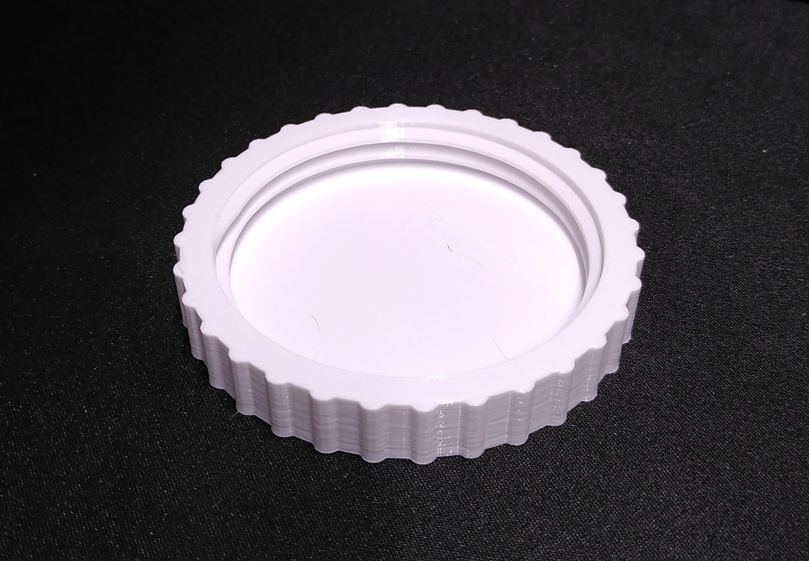
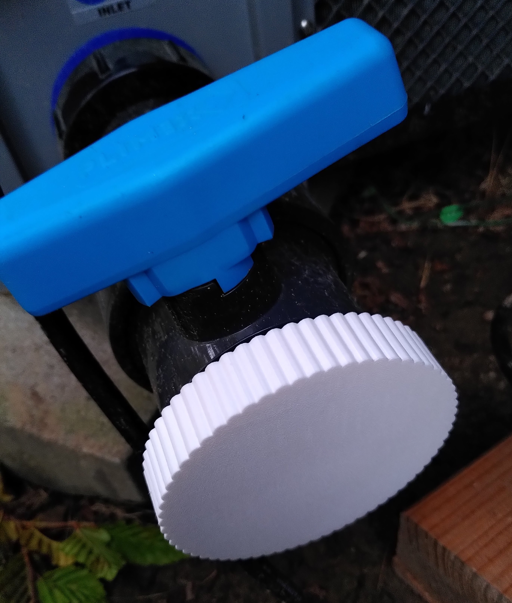

# cap-generator

OpenSCAD cap with thread generator

## Screenshot

## Installation

### Windows

As stated [here](https://en.wikibooks.org/wiki/OpenSCAD_User_Manual/Libraries), go to `File` -> `Show Library Folder...`
and copy or clone the whole git repository into this folder.

## 3D Printing

I printed this with a Prusa MK3S on 0.2mm SPEED settings with PETG filament.
Use a maximum layer height of 0.2mm, a height of 0.3mm did not work for me.

`cap_height = 3` is good for stiff caps up to 50mm.

For faster printing use a higher knurl_spacer setting (to get less knurls), and
a thiner cap diameter.

Careful: printing without any knurl makes it very hard to tighten or loosen the
cap by hand.

## Examples

